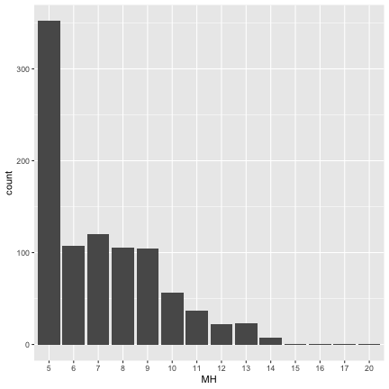
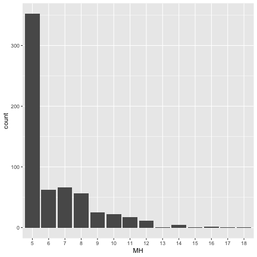
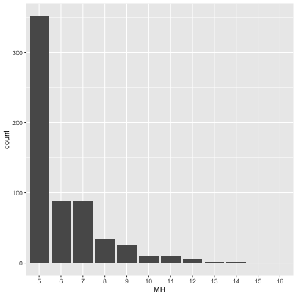
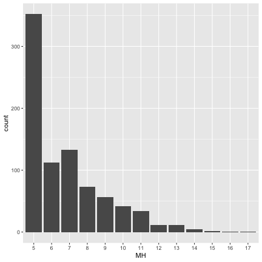
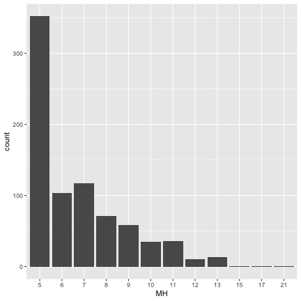
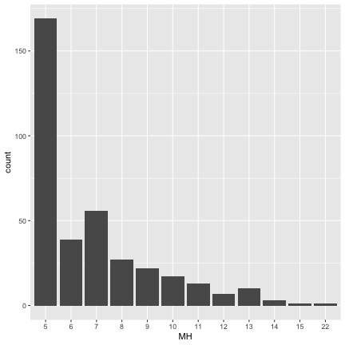
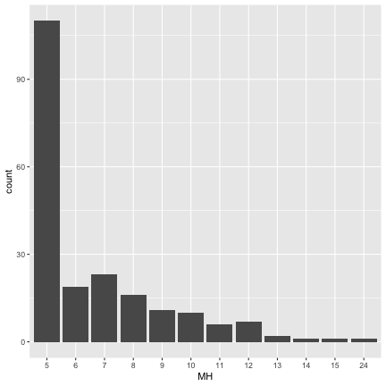

#


This report was automatically generated with the R package **knitr**
(version 1.41).


```r
library(haven)
library(ggplot2)
library(data.table)
Tab <- function(data, var1, code, var2) {
    data <- as.data.frame(data)
    i <- which(names(data) == var1)
    j <- which(names(data) == var2)
    n <- nrow(data[data[, i] == code, ])
    tableA <- table(data[data[, i] == code, j])
    Table1 <- cbind(Freq. = tableA,
                    Percent = round(tableA / n * 100, 3),
                    Cum. = round(cumsum(tableA) / n * 100, 3)) |> data.frame()
    Table1 <- rbind(Table1, Total = c(sum(Table1$Freq.), round(sum(Table1$Percent), 0), ''))
    return(Table1)
}

tscs212 <- read_dta("../../HW/tscs212.dta") |> setDT()
tscs212 <- (tscs212[!(e24a > 5 | e24b > 5 | e24c > 5 | e24d >  5 | e24e > 5), ]
                   [, ":="(MH = e24a + e24b + e24c+ e24d + e24e)])

cor(tscs212[, .(e24a, e24b, e24c, e24d, e24e)])
```

```
##           e24a      e24b      e24c      e24d      e24e
## e24a 1.0000000 0.6105912 0.4628381 0.4163958 0.4440856
## e24b 0.6105912 1.0000000 0.4557066 0.3518958 0.3565775
## e24c 0.4628381 0.4557066 1.0000000 0.7110378 0.6139077
## e24d 0.4163958 0.3518958 0.7110378 1.0000000 0.6951400
## e24e 0.4440856 0.3565775 0.6139077 0.6951400 1.0000000
```

```r
data1 <- tscs212[, .(e24a, e24b, e24c, e24d, e24e, e24f, e24g, e24h, MH = as.factor(MH))]

# MH #
tableA <- table(data1[, MH])
tableB <- cumsum(tableA)
Table1 <- cbind(Freq. = tableA,
                Percent = round(tableA / nrow(data1) * 100, 2),
                Cum. = round(tableB / nrow(data1) * 100, 2)) |> data.frame()
Table1 <- rbind(Table1, Total = c(sum(Table1$Freq.), sum(Table1$Percent), ''))
Table1
```

```
##       Freq. Percent  Cum.
## 5       352   22.15 22.15
## 6       118    7.43 29.58
## 7       152    9.57 39.14
## 8       138    8.68 47.83
## 9       140    8.81 56.64
## 10      159   10.01 66.65
## 11      119    7.49 74.13
## 12      101    6.36 80.49
## 13      101    6.36 86.85
## 14       58    3.65  90.5
## 15       54     3.4  93.9
## 16       21    1.32 95.22
## 17       26    1.64 96.85
## 18       15    0.94  97.8
## 19        8     0.5  98.3
## 20        7    0.44 98.74
## 21        5    0.31 99.06
## 22        5    0.31 99.37
## 23        4    0.25 99.62
## 24        4    0.25 99.87
## 25        2    0.13   100
## Total  1589     100
```

```r
# e24a #
Tab(data1, 'e24a', 1, 'MH')
```

```
##       Freq. Percent   Cum.
## 5       352  37.567 37.567
## 6       107  11.419 48.986
## 7       120  12.807 61.793
## 8       105  11.206 72.999
## 9       104  11.099 84.098
## 10       56   5.977 90.075
## 11       37   3.949 94.023
## 12       22   2.348 96.371
## 13       23   2.455 98.826
## 14        7   0.747 99.573
## 15        1   0.107  99.68
## 16        1   0.107 99.787
## 17        1   0.107 99.893
## 18        0       0 99.893
## 19        0       0 99.893
## 20        1   0.107    100
## 21        0       0    100
## 22        0       0    100
## 23        0       0    100
## 24        0       0    100
## 25        0       0    100
## Total   937     100
```

```r
ggplot(data1[e24a == 1, .(MH = as.factor(MH))], aes(MH))+
    geom_bar()
```



```r
# e24b #
Tab(data1, 'e24b', 1, 'MH')
```

```
##       Freq. Percent   Cum.
## 5       352  56.683 56.683
## 6        62   9.984 66.667
## 7        66  10.628 77.295
## 8        56   9.018 86.312
## 9        25   4.026 90.338
## 10       22   3.543 93.881
## 11       17   2.738 96.618
## 12       11   1.771  98.39
## 13        1   0.161 98.551
## 14        4   0.644 99.195
## 15        1   0.161 99.356
## 16        2   0.322 99.678
## 17        1   0.161 99.839
## 18        1   0.161    100
## 19        0       0    100
## 20        0       0    100
## 21        0       0    100
## 22        0       0    100
## 23        0       0    100
## 24        0       0    100
## 25        0       0    100
## Total   621     100
```

```r
ggplot(data1[e24b == 1, .(MH = as.factor(MH))], aes(MH))+
    geom_bar()
```



```r
# e24c #
Tab(data1, 'e24c', 1, 'MH')
```

```
##       Freq. Percent   Cum.
## 5       352  56.866 56.866
## 6        88  14.216 71.082
## 7        89  14.378  85.46
## 8        34   5.493 90.953
## 9        26     4.2 95.153
## 10        9   1.454 96.607
## 11        9   1.454 98.061
## 12        6   0.969 99.031
## 13        2   0.323 99.354
## 14        2   0.323 99.677
## 15        1   0.162 99.838
## 16        1   0.162    100
## 17        0       0    100
## 18        0       0    100
## 19        0       0    100
## 20        0       0    100
## 21        0       0    100
## 22        0       0    100
## 23        0       0    100
## 24        0       0    100
## 25        0       0    100
## Total   619     100
```

```r
ggplot(data1[e24c == 1, .(MH = as.factor(MH))], aes(MH))+
    geom_bar()
```



```r
# e24d #
Tab(data1, 'e24d', 1, 'MH')
```

```
##       Freq. Percent   Cum.
## 5       352  42.308 42.308
## 6       112  13.462 55.769
## 7       133  15.986 71.755
## 8        73   8.774 80.529
## 9        56   6.731  87.26
## 10       42   5.048 92.308
## 11       34   4.087 96.394
## 12       11   1.322 97.716
## 13       11   1.322 99.038
## 14        4   0.481 99.519
## 15        2    0.24  99.76
## 16        1    0.12  99.88
## 17        1    0.12    100
## 18        0       0    100
## 19        0       0    100
## 20        0       0    100
## 21        0       0    100
## 22        0       0    100
## 23        0       0    100
## 24        0       0    100
## 25        0       0    100
## Total   832     100
```

```r
ggplot(data1[e24d == 1, .(MH = as.factor(MH))], aes(MH))+
    geom_bar()
```



```r
# e24e #
Tab(data1, 'e24e', 1, 'MH')
```

```
##       Freq. Percent   Cum.
## 5       352   44.11  44.11
## 6       103  12.907 57.018
## 7       117  14.662 71.679
## 8        71   8.897 80.576
## 9        58   7.268 87.845
## 10       35   4.386 92.231
## 11       36   4.511 96.742
## 12       10   1.253 97.995
## 13       13   1.629 99.624
## 14        0       0 99.624
## 15        1   0.125 99.749
## 16        0       0 99.749
## 17        1   0.125 99.875
## 18        0       0 99.875
## 19        0       0 99.875
## 20        0       0 99.875
## 21        1   0.125    100
## 22        0       0    100
## 23        0       0    100
## 24        0       0    100
## 25        0       0    100
## Total   798     100
```

```r
ggplot(data1[e24e == 1, .(MH = as.factor(MH))], aes(MH))+
    geom_bar()
```



```r
# e24f #
Tab(data1, 'e24f', 5, 'MH')
```

```
##       Freq. Percent   Cum.
## 5       334   44.18  44.18
## 6        90  11.905 56.085
## 7       108  14.286  70.37
## 8        66    8.73 79.101
## 9        56   7.407 86.508
## 10       35    4.63 91.138
## 11       30   3.968 95.106
## 12       16   2.116 97.222
## 13       13    1.72 98.942
## 14        6   0.794 99.735
## 15        1   0.132 99.868
## 16        1   0.132    100
## 17        0       0    100
## 18        0       0    100
## 19        0       0    100
## 20        0       0    100
## 21        0       0    100
## 22        0       0    100
## 23        0       0    100
## 24        0       0    100
## 25        0       0    100
## Total   756     100
```

```r
ggplot(data1[e24f == 5, .(MH = as.factor(MH))], aes(MH))+
    geom_bar()
```


```r
# e24g #
Tab(data1, 'e24g', 1, 'MH')
```

```
##       Freq. Percent   Cum.
## 5       169  46.301 46.301
## 6        39  10.685 56.986
## 7        56  15.342 72.329
## 8        27   7.397 79.726
## 9        22   6.027 85.753
## 10       17   4.658 90.411
## 11       13   3.562 93.973
## 12        7   1.918  95.89
## 13       10    2.74  98.63
## 14        3   0.822 99.452
## 15        1   0.274 99.726
## 16        0       0 99.726
## 17        0       0 99.726
## 18        0       0 99.726
## 19        0       0 99.726
## 20        0       0 99.726
## 21        0       0 99.726
## 22        1   0.274    100
## 23        0       0    100
## 24        0       0    100
## 25        0       0    100
## Total   365     100
```

```r
ggplot(data1[e24g == 1, .(MH = as.factor(MH))], aes(MH))+
    geom_bar()
```



```r
# e24h #
Tab(data1, 'e24h', 1, 'MH')
```

```
##       Freq. Percent   Cum.
## 5       110   53.14  53.14
## 6        19   9.179 62.319
## 7        23  11.111  73.43
## 8        16   7.729 81.159
## 9        11   5.314 86.473
## 10       10   4.831 91.304
## 11        6   2.899 94.203
## 12        7   3.382 97.585
## 13        2   0.966 98.551
## 14        1   0.483 99.034
## 15        1   0.483 99.517
## 16        0       0 99.517
## 17        0       0 99.517
## 18        0       0 99.517
## 19        0       0 99.517
## 20        0       0 99.517
## 21        0       0 99.517
## 22        0       0 99.517
## 23        0       0 99.517
## 24        1   0.483    100
## 25        0       0    100
## Total   207     100
```

```r
ggplot(data1[e24h == 1, .(MH = as.factor(MH))], aes(MH))+
    geom_bar()
```



```r
#library(gmodels)
#with(data1, CrossTable(e24c))
#knitr::stitch_rmd("1116.R")
```

The R session information (including the OS info, R version and all
packages used):


```r
sessionInfo()
```

```
## R version 4.2.2 (2022-10-31)
## Platform: x86_64-apple-darwin17.0 (64-bit)
## Running under: macOS Ventura 13.0.1
## 
## Matrix products: default
## LAPACK: /Library/Frameworks/R.framework/Versions/4.2/Resources/lib/libRlapack.dylib
## 
## locale:
## [1] en_US.UTF-8/en_US.UTF-8/en_US.UTF-8/C/en_US.UTF-8/en_US.UTF-8
## 
## attached base packages:
## [1] stats     graphics  grDevices utils     datasets  methods   base     
## 
## other attached packages:
## [1] data.table_1.14.6 ggplot2_3.4.0     haven_2.5.1      
## 
## loaded via a namespace (and not attached):
##  [1] pillar_1.8.1     compiler_4.2.2   highr_0.9        forcats_0.5.2    tools_4.2.2     
##  [6] digest_0.6.30    evaluate_0.18    lifecycle_1.0.3  tibble_3.1.8     gtable_0.3.1    
## [11] pkgconfig_2.0.3  rlang_1.0.6      cli_3.4.1        DBI_1.1.3        rstudioapi_0.14 
## [16] commonmark_1.8.1 yaml_2.3.6       xfun_0.35        fastmap_1.1.0    withr_2.5.0     
## [21] stringr_1.4.1    dplyr_1.0.10     knitr_1.41       generics_0.1.3   vctrs_0.5.1     
## [26] hms_1.1.2        grid_4.2.2       tidyselect_1.2.0 glue_1.6.2       R6_2.5.1        
## [31] fansi_1.0.3      rmarkdown_2.18   farver_2.1.1     tzdb_0.3.0       readr_2.1.3     
## [36] magrittr_2.0.3   scales_1.2.1     ellipsis_0.3.2   htmltools_0.5.3  rsconnect_0.8.28
## [41] assertthat_0.2.1 mime_0.12        colorspace_2.0-3 labeling_0.4.2   tinytex_0.42    
## [46] utf8_1.2.2       stringi_1.7.8    munsell_0.5.0    markdown_1.4
```

```r
Sys.time()
```

```
## [1] "2022-11-22 19:09:02 CST"
```

